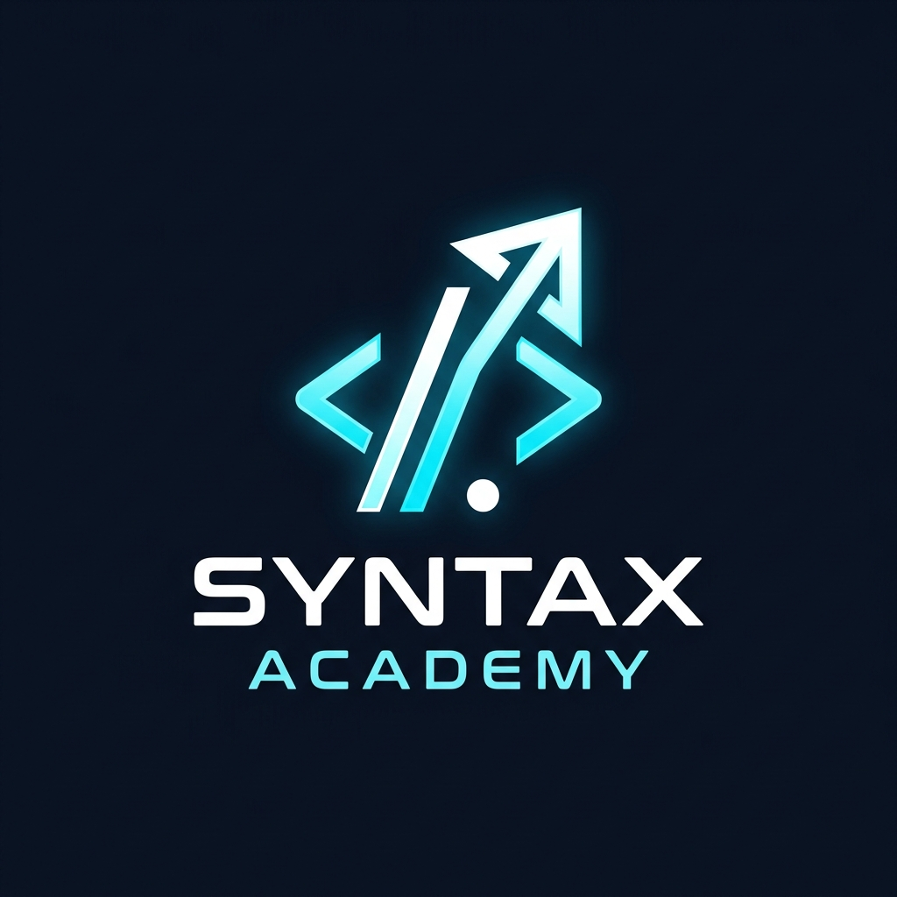

# Syntax Academy




---

## What is this project?

Syntax Academy is a polished Django-based learning platform built to run a small online academy. It gives students a place to discover courses, watch lessons, download notes, take quizzes, and manage their learning — while giving admins a dashboard to manage courses, payments, reviews, students, and support.

## Why this repo matters

This is not just a demo. It is a working full-stack LMS with:

- public course browsing and enrollment
- OTP user registration and login flows
- content management for lessons, notes, quizzes, and course resources
- payment handling with Cashfree sandbox integration
- PDF invoice generation and email notifications
- a separate admin dashboard for managing students, courses, contacts, quizzes, and reports

## What you get

- learner-facing course catalog with video lessons and downloads
- student quizzes, progress tracking, and results
- reviews, comments, replies, favorites
- admin controls for every major section of the platform
- file upload support for media assets

## Quick setup

### 1. Open a terminal in the repo root

```powershell
cd "c:\Users\admin\OneDrive\Desktop\BrainyBeam Project\Syntax"
```

### 2. Create and activate a virtual environment

```powershell
python -m venv venv
venv\Scripts\Activate.ps1
python -m pip install --upgrade pip
```

### 3. Install required libraries

```powershell
pip install -r requirements.txt
```

### 4. Apply migrations

```powershell
python manage.py makemigrations
python manage.py migrate
```

### 5. Create a superuser (optional)

```powershell
python manage.py createsuperuser
```

### 6. Run the development server

```powershell
python manage.py runserver
```

### 7. Visit the app

- Public site: `http://127.0.0.1:8000/`
- Custom admin dashboard: `http://127.0.0.1:8000/admin-dashboard/`
- Default Django admin: `http://127.0.0.1:8000/admin/`

## Required configuration

Before you use email or payment features, update these values in `syn/syn/settings.py`:

- `EMAIL_HOST_USER`
- `EMAIL_HOST_PASSWORD`
- `CASHFREE_CLIENT_ID`
- `CASHFREE_CLIENT_SECRET`
- `CASHFREE_ENVIRONMENT`
- `DEBUG`
- `ALLOWED_HOSTS`

> The current settings use sandbox Cashfree credentials and Gmail SMTP values for local development only.

## Project structure

- `syn/syn/` — Django project config and settings
- `syn/app1/` — public learner portal, course controls, payment flow, quizzes
- `syn/adminpanel/` — admin dashboard for site management
- `media/` — uploaded files for course content, videos, and notes
- `db.sqlite3` — development database

## Important details

- `rest_framework` is used for serializers and API-style endpoints.
- `cashfree-pg` handles the payment gateway workflow.
- `reportlab` is used to generate PDF payment receipts.
- `Pillow` supports image uploads for courses and media.
- `requests` is used for external HTTP calls.

## Tips for a smoother run

- Keep `MEDIA_ROOT` and `MEDIA_URL` configured correctly in `settings.py`.
- Do not commit `EMAIL_HOST_PASSWORD` or any secret keys.
- Use a `.env` system or environment variables for production.
- If you see a missing package error, install it with `pip install <package>`.

## One-line description

A complete Django-powered learning management system for Syntax Academy—with course browsing, learner workflows, quizzes, payments, and a connected admin dashboard.

---

If you want, I can also add a short demo section, a contribution guide, or a `.gitignore` file next. 